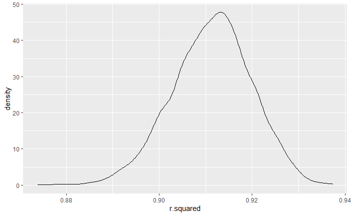

## Introduction

This report is used to explain assignment 6 of R language. Assignment 6 mainly focuses on the study of linear regression models in R language.

```{r setup, include=FALSE}
knitr::opts_chunk$set(prompt = TRUE, comment = '', collapse = TRUE, message = FALSE, warning = FALSE)
library(dplyr)
library(tidyr)
library(tidyverse)
library(modelr)
set.seed(1)
```
## Problem 1
For Problem 1, we use the following code to get the 2017 Central Park weather data.
```{r}
weather_df = 
  rnoaa::meteo_pull_monitors(
    c("USW00094728"),
    var = c("PRCP", "TMIN", "TMAX"), 
    date_min = "2017-01-01",
    date_max = "2017-12-31") %>%
  mutate(
    name = recode(id, USW00094728 = "CentralPark_NY"),
    tmin = tmin / 10,
    tmax = tmax / 10) %>%
  select(name, id, everything())
```
Then, with tmax as the response variable and tmin as the independent variable, a simple linear regression is established.Observe the magnitude of the logarithmic interaction between β0 and β1, and R squared.

```{r}
fit = lm(tmax~tmin,data = weather_df)
log_interaction = fit %>%
  broom::tidy() %>%
  select(term, estimate) %>%
  pivot_wider(names_from = term, values_from = estimate) %>%
  rename(intercept = `(Intercept)`) %>%
  mutate(log_interact = intercept * tmin) %>%
  select(log_interact)
log_interaction
```
```{r}
r_square = fit %>%
  broom::glance() %>%
  select(r.squared)
r_square
```

Define the resampling function to resample the sample data, extract 5000 samples to perform the above process, and use ggplot to describe the density distribution of the above two quantities.
```{r}
boot_sample = function(df) {
  sample_frac(df, replace = TRUE)
}

```

```{r}

boot_straps = 
  data_frame(
    strap_number = 1:5000,
    strap_sample = rerun(5000, boot_sample(weather_df))
  )

boot_straps
```

```{r}
bootstrap_results_LogInteraction = 
  boot_straps %>% 
  mutate(
    models = map(strap_sample, ~lm(tmax~tmin, data = .x) ),
    results = map(models, broom::tidy)) %>%
  select(-strap_sample, -models) %>% 
  unnest(results) %>%
  pivot_wider(id_cols = strap_number, names_from = term, values_from = estimate) %>%
  rename(intercept = `(Intercept)`) %>%
  mutate(log_interact = log(intercept * tmin))
bootstrap_results_LogInteraction %>%
  ggplot(aes(x=log_interact)) + geom_density()

bootstrap_results_LogInteraction %>% 
  summarize(
    ci_lower = quantile(log_interact, 0.025), 
    ci_upper = quantile(log_interact, 0.975))
```


```{r}
bootstrap_results_RSquare = 
  boot_straps %>% 
  mutate(
    models = map(strap_sample, ~lm(tmax~tmin, data = .x) ),
    results = map(models, broom::glance)) %>%
  select(-strap_sample, -models) %>% 
  unnest(results) %>%
  select(r.squared)
bootstrap_results_RSquare %>%
  ggplot(aes(x=r.squared)) + geom_density()


bootstrap_results_RSquare %>% 
  summarize(
    ci_lower = quantile(r.squared, 0.025), 
    ci_upper = quantile(r.squared, 0.975))
```


It can be seen that the distribution of logarithmic interaction term belongs to normal distribution, and the 95% confidence interval of this variable is given. For r squared term, its distribution is slightly left.

## Problem 2
Use the data on homicides in 50 large U.S. cities collected by The Washington Post for the second question. Firstly, the data is preprocessed, and a new variable city_state is created to unite two fields city and state. Dallas, TX; Phoenix, AZ; and Kansas City, MO; Tulsa, AL cities  are ignored. Then screen the data, limit the scope of research to only white and black people.
```{r}
homicides_df = read.csv("./data/homicide-data.csv")
homicides_df = homicides_df %>%
  mutate(solved = ifelse(homicides_df$disposition == "Closed by arrest",1,0),
         city_state = paste(homicides_df$city,homicides_df$state),
         victim_age = as.numeric(victim_age)) %>%
  filter((victim_race %in% c("White","Black")) & (!(city_state %in% c("Dallas TX","Phoenix AZ","Kansas City MO","Tulsa AL"))) & (victim_sex != "Unknown"))
head(homicides_df)
```

For the processed data, aiming at Baltimore, MD, a logistic regression model is established by glm. The response variable is the result of homocides handling, and the independent variables are age, gender and race. Then obtaine the estimated and confidence interval of the adjusted odds ratio for solving homicides comparing male victims to female victims keeping all other variables fixed.
```{r}
fit_logistic = homicides_df %>%
  filter(city_state == "Baltimore MD") %>%
  glm(solved~victim_age + victim_race + victim_sex, data = ., family = binomial())

fit_logistic %>% 
  broom::tidy() %>%
  mutate(CI1 = confint(fit_logistic),
         CI2 = confint(fit_logistic),
         OR = exp(estimate)) %>%
  select(term, estimate, OR, p.value, CI1, CI2) %>%
  filter(term == "victim_sexMale") %>%
  knitr::kable(digits = 3)
```
Then, perform the above process for all cities, and create a plot that shows the estimators and CIs for each city.
```{r}
sampling = function(df, param){
  df = filter(df,city==param)
  df
}

parse = function(result){
  parse_result = 
  result %>%
  broom::tidy() %>%
  mutate(CI = confint(result),
         OR = exp(estimate)) %>%
  select(term, estimate, OR, p.value, CI) %>%
  filter(term == "victim_sexMale")
  parse_result
}
```


```{r}
city_df = 
  data_frame(city=unique(homicides_df$city),
             sample = purrr::map(unique(homicides_df$city), ~sampling(df=homicides_df,param = .x)))
city_df
```

```{r}
city_results = city_df %>%
  mutate(
    models = map(sample, ~glm(solved~victim_age + victim_race + victim_sex, data = .x, family = binomial())),
    results = map_dfr(models,parse,.id="input")) %>%
  select(-sample,-models)  %>%
  unnest(results)
head(city_results)
```

```{r}
city_results %>%
  ggplot() +
  geom_errorbar(aes(x=city,ymin=CI[,1],ymax=CI[,2],color=city),position = position_dodge()) +
  ggtitle("CI for city") +
  theme(axis.text.x = element_text(angle = 90))
```


```{r}
city_results %>%
  ggplot(aes(x=city,y=OR,color=city)) + 
  geom_bar(stat = "identity") +
  ggtitle("ORs for city") +
  theme(axis.text.x = element_text(angle = 90))
```


It can be seen that the length of CIs is different for different cities. Among them, the OR for the city of Albuquerque is the largest.


## Problem 3
For Problem 3, analyze the data gathered to understand the effects of severe variables on a child's birth weight. After loading the data, delete the observations with missing values, and convert babysex, frace, malform and mrace into factor variables.
```{r}
birthweight_df = read.csv("./data/birthweight.csv")
birthweight_df = 
  birthweight_df %>%
  drop_na() %>%
  mutate(babysex = as.factor(babysex),
         frace = as.factor(frace),
         malform = as.factor(malform),
         mrace = as.factor(mrace))
birthweight_df
```

Then, taking bwt as the corresponding variable and smoken, momage and ppwt as independent variables, a linear regression model is established and the corresponding prediction is made. It can be seen that the prediction error is relatively large.
```{r}
model = lm(bwt ~ smoken+momage+ppwt, data = birthweight_df)
birthweight_df %>% 
  mutate(id=1:4342) %>%
  add_predictions(model) %>%
  ggplot(aes(x=id,y=bwt)) + geom_point() + geom_point(aes(y = pred), color = "red")
```


Adding residuals to the data set, there is no obvious difference in the distribution of residuals in gender.
```{r}
birthweight_df %>% 
  add_residuals(model) %>%
  ggplot(aes(x=babysex,y=resid)) + geom_violin()
```


After that, established two other linear regression models respectively, and cross-verified the prediction errors of the models.

```{r}
cv_df = crossv_mc(birthweight_df, 100)
cv_df =
  cv_df %>% 
  mutate(
    train = map(train, as_tibble),
    test = map(test, as_tibble))
cv_df = 
  cv_df %>% 
  mutate(My_mod = map(train, ~lm(bwt ~ smoken+momage+ppwt, data = .x)),
         A_mod  = map(train, ~lm(bwt ~ blength+gaweeks, data = .x)),
         B_mod  = map(train, ~lm(bwt ~ bhead+blength+babysex, data = .x))) %>%
  mutate(rmse_my = map2_dbl(My_mod, test, ~rmse(model = .x, data = .y)),
         rmse_A = map2_dbl(A_mod, test, ~rmse(model = .x, data = .y)),
         rmse_B = map2_dbl(B_mod, test, ~rmse(model = .x, data = .y)))
cv_df
```


```{r}
cv_df %>% 
  select(starts_with("rmse")) %>% 
  pivot_longer(
    everything(),
    names_to = "model", 
    values_to = "rmse",
    names_prefix = "rmse_") %>% 
  mutate(model = fct_inorder(model)) %>% 
  ggplot(aes(x = model, y = rmse)) + 
  geom_violin()

```


As you can see, the model we established has the worst performance on rmse index, while the model B has the best performance.
